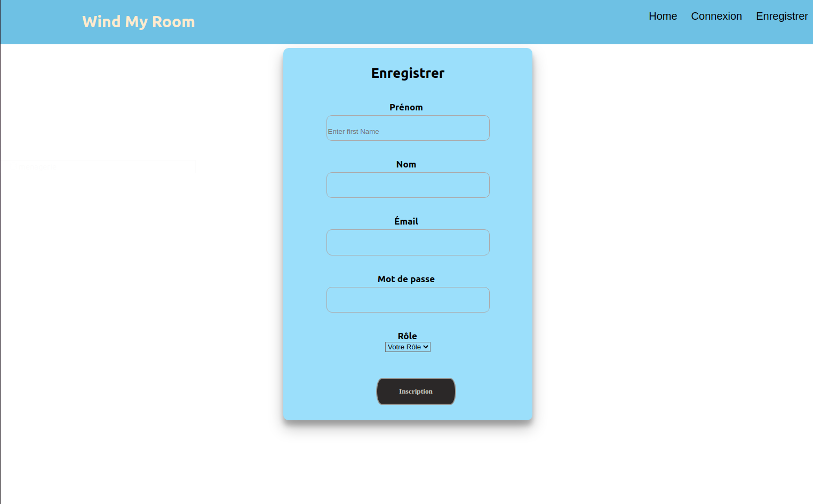

# 🚀 Wind my roof

### Table of Contents

- [Description](#description)
- [How To Use](#how-to-use)
- [Contributor](#contributor)

---

## 📖 Description

Wind my roof is a **full stack** project made with React it consist of signup and login with different roles like Admin and User

#### 🔬 Technologies

  
    
    
    
    

## How To Use

#### ⚙️ Installation

1.  Initialisation of a package.json

            npm init

2.  Installation of modules

            npm i express
            npm i bcrypt
            npm i body-parser
            npm i cookie-parser
            npm i cors
            npm i dotenv
            npm i env
            npm i jsonwebtoken
            npm i mysql2
            npm i nodemon
            npm i prettier
            npm i morgan

## Contributors

-<spam>Filmon Saere</spam> [][github]

 
 

[github]: https://github.com/filmons